[Other Language（其他语言）](./docs/)

# obsidian-any-block

A Obsidian Plugin. You can flexibility to create a 'Block' by some means.
 
## Usage

Function：Block conversion、list to table or other tree graph，See the `demo` sample folder for details

[中文教程和示例库](./docs/en)

## If bug

~~try to close `strict line wrapping`~~

## Suport command

Look the setup panel or [中文教程和示例库](./docs/en)

다음은 몇 가지 일반적인 프로세서입니다:
- 목록을 표로 변환
- 목록을 목록표로 변환
- 목록을 플로우차트로 변환
- 목록을 마인드맵으로 변환
- 목록을 탭으로 변환
- 목록을 타임라인으로 변환
- 제목을 목록으로 변환하여 다른 것으로 변환 (title2list 프로세서를 사용할 수 있음)

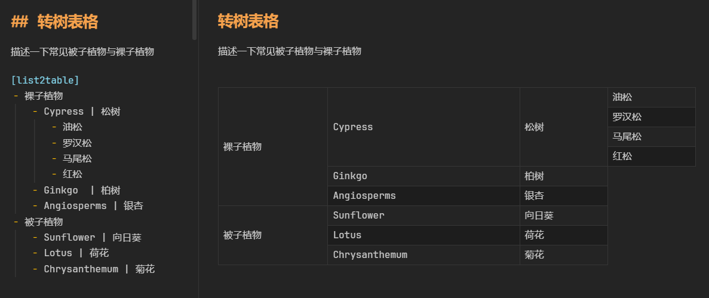

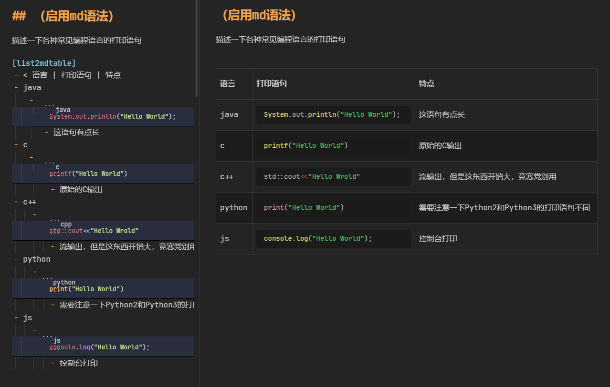

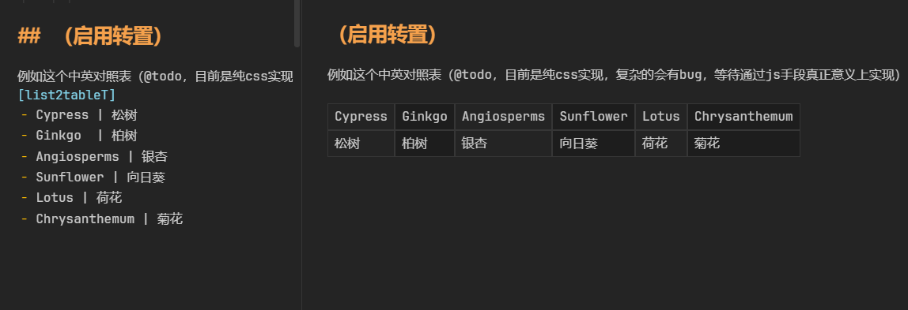

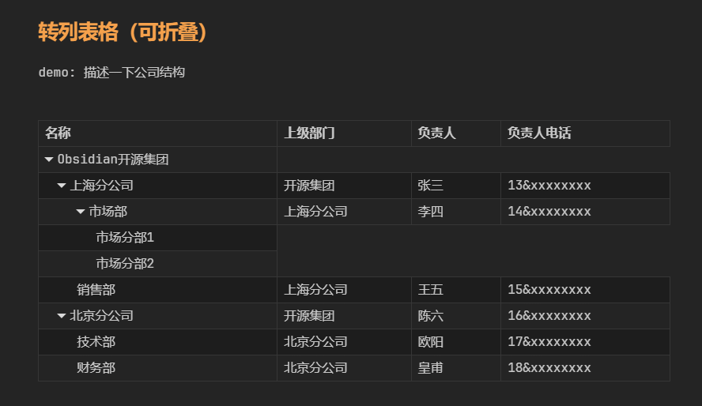

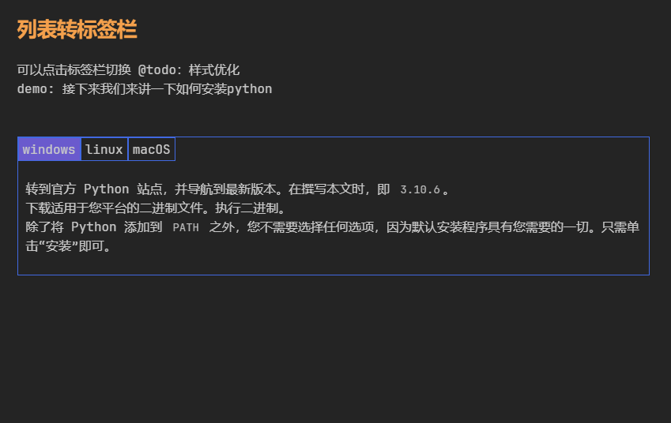

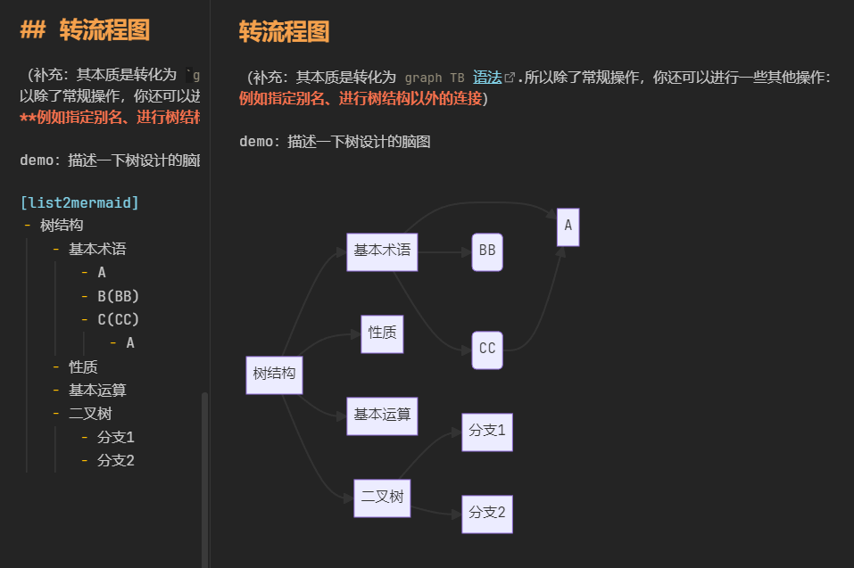

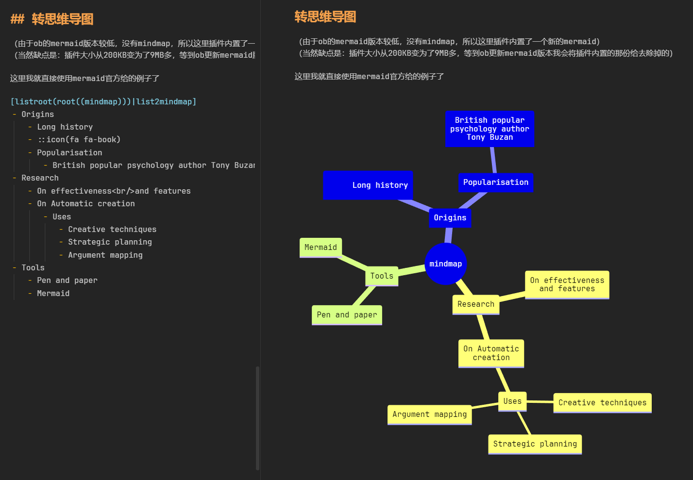

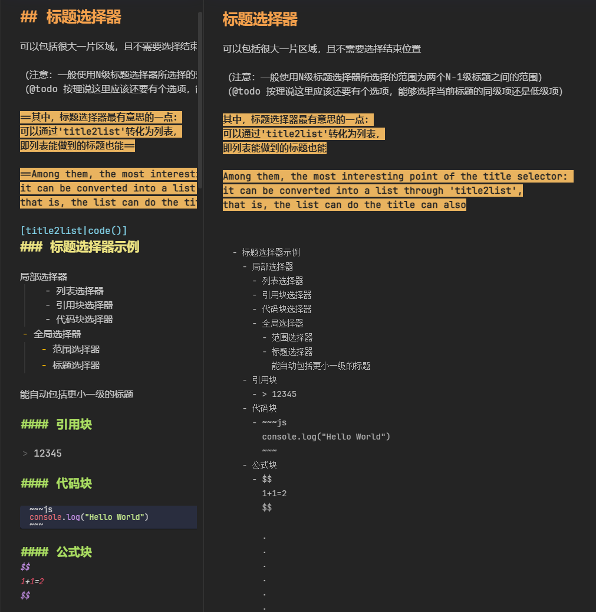

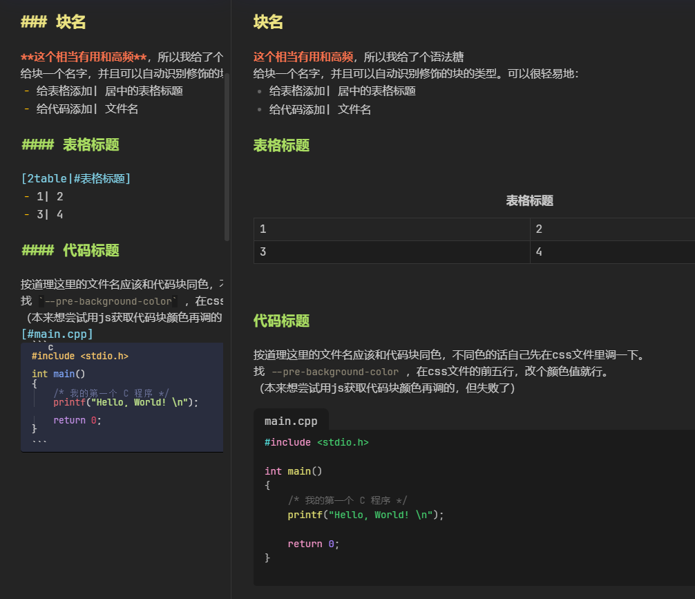

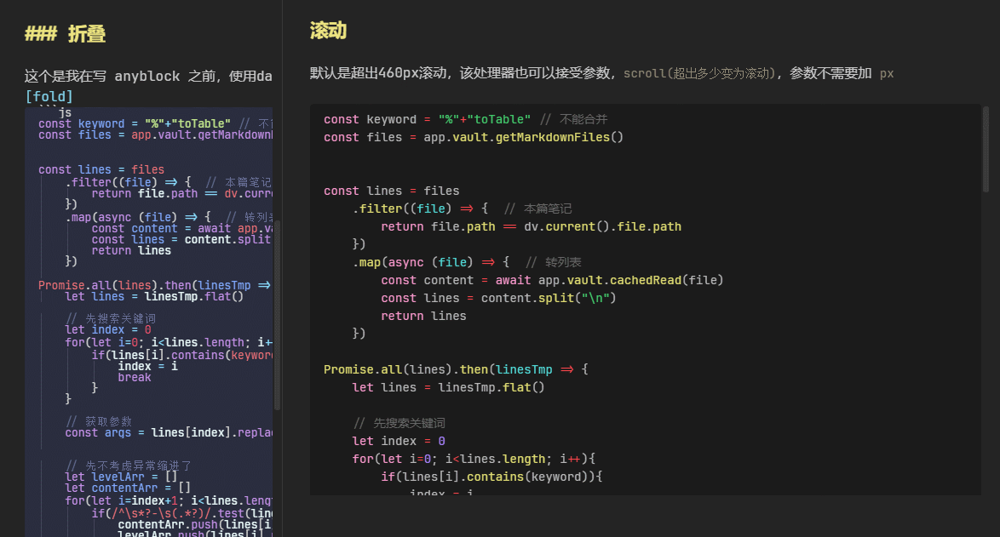

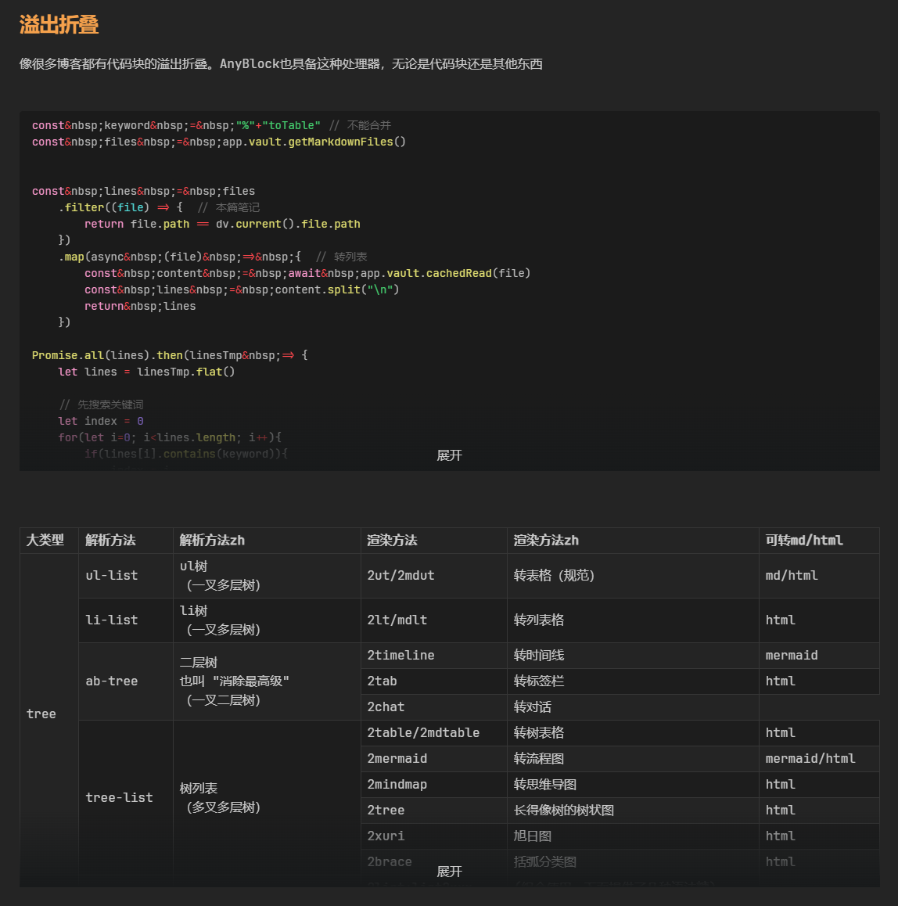

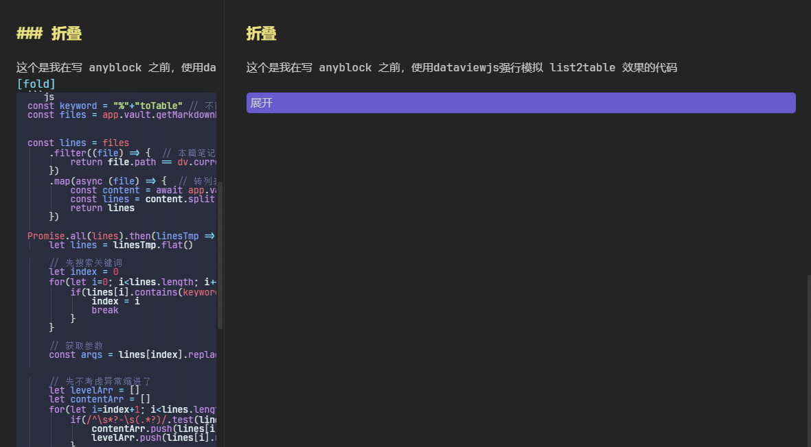

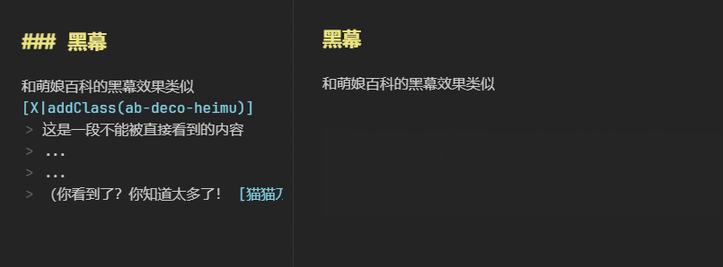

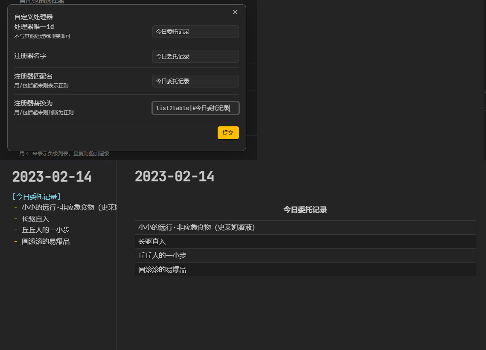

## support

개발은 쉽지 않습니다, 후원 입구 (비고: OB 플러그인 지원 가능)

## Todo

**(Don't repet it in issue)**

- reinforce
	- 선택기
		- **중첩 선택기**
		  중첩이 없는 프로그램은 영혼이 없습니다 !!!
		  (하지만 문제는, 예를 들어 첫 번째 레벨이 트리인 경우 구조를 파괴할 수 있으며 모호성이 있습니다. 현재 트리 형식은 number-str이므로 number-dom이 필요합니다)
		  (또는: 목록 선택기는 중첩 목록 선택기가 모호하므로 중첩 참조 선택기가 필요하며, 이 기반에서 참조 선택기를 해제하여 간접적으로 중첩)
	- 프로세서
		- QA 프로세서
		- 2ultable 최적화, 이 모드에서 인라인 줄 바꿈을 동일 레벨 줄 바꿈으로 변환
	- 계층
		- 음수 레벨 목록 스위치
		- 계층 관계에 따라 합리적인 프로세서를 추천 (예: 트리 관련이 감지되면 트리 유형 프로세서를 추천)
	- 스타일
		- 트리 테이블의 간격 색상 스타일을 최적화할 수 있습니다
		  방법1: 예를 들어 여러 줄의 셀은 상황에 따라 그라데이션을 사용할 수 있습니다 (단수는 사용하지 않고, 복수는 필요하지만 불일치 문제가 있을 수 있음)?
		  방법2: 마인드맵과 유사한 색상, 후속 열은 행간 색상을 사용하지 않음
	- 변환
		- 마우스 오른쪽 버튼으로 선택하여 변환: md 원본(표)/html 형식/이미지
- fixing bug
	- 체크박스 목록의 호환성, 순서 목록의 호환성
	- **참조 블록 내의 목록/목록 내의 참조 블록을 인식할 수 없음**
	- **표 전치와 표 머리글 기호 충돌, 전치 모드는 현재 순수 CSS로 구현됨. 모든 사람의 행 높이가 다르면 불일치가 발생할 수 있음.**
	  후속으로 CSS 구현을 테이블 요소 변환 구현으로 개선할 예정

Reference、import

- [html-to-md](https://github.com/stonehank/html-to-md)
- [mermaid](https://github.com/mermaid-js/mermaid)